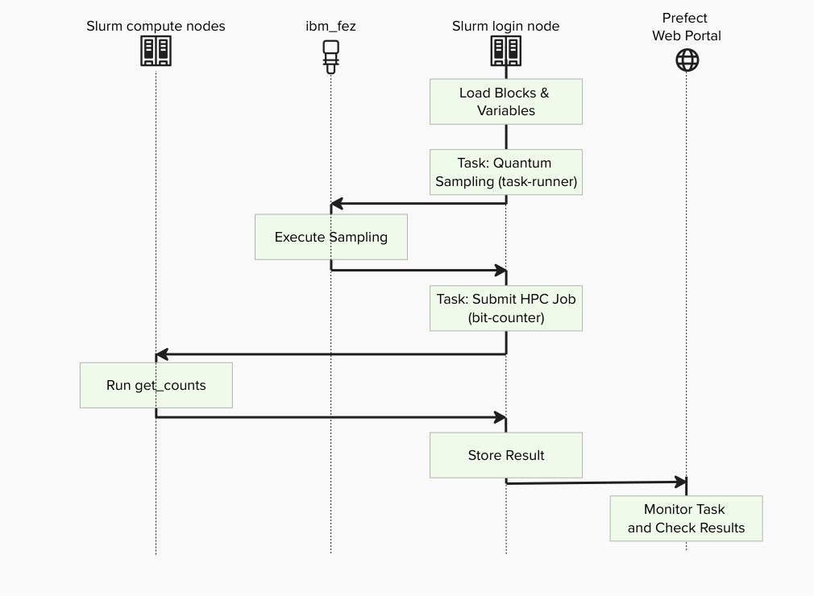

# Create Your QCSC Workflow with Prefect

This hands-on tutorial guides you through building a small C++ program (bit-counts) on a Slurm cluster and integrating it into a Prefect workflow using a custom [`SlurmJobBlock` class](https://github.com/eklee15/rpi_qcsc_demo/blob/d3eaed80341bff8942d37bd4f2ca2eeff99e83f7/prefect_slurm/core.py#L12) .
On the Prefect workflow, we also use [Prefect Qiskit](https://github.com/qiskit-community/prefect-qiskit) to show how to write a complete QCSC workflow from scratch.

Our objective is to compute a count dictionary of sampler bitstrings using MPI programming on the QCSC architecture.



## Prefect Core Concepts

We will use these terms:
- **Flow**: the end-to-end workflow defined in sampler_workflow_qrmi.py
- **Task**: individual steps inside the flow (e.g., runtime.sampler(...), counter.get(...))
- **Block**: reusable configuration + credentials stored in Prefect server
  - `bit-counter` : HPC job configuration (queue, nodes, executable path, modules)
  - `task-runner`: Quantum job configuration (executable, output) 
- **Variable**: run-time parameter stored server-side (sampler shots etc.)

## Create BitCounts Workflow

## Step 1. Log in to the Slurm Cluster

Connect to the Slurm cluster login node using SSH. This is where we will develop the workflow.

<br>
```bash
ssh -L 4200:dcsfen01:4200 USER_ID@blp03.ccni.rpi.edu
```
blp03 is [landing pad](https://docs.cci.rpi.edu/landingpads/) and dcsfen01 is [front-end node](https://docs.cci.rpi.edu/clusters/DCS_Supercomputer/). Different nodes can be used with your `USER_ID`. Local port forwarding ([port `4200`](https://docs.prefect.io/v3/get-started/install)) is initiated in order to use Prefect GUI. 

## Step 2. Set up Environment
**Conda Environment**

<br>
```bash
# Install Conda
bash ./install_conda.sh
conda config --add channels conda-forge
# Create your environment with YOUR_ENV_NAME
conda env create -f conda_env.yml -n YOUR_ENV_NAME --force 
# Activate conda environment
conda activate YOUR_ENV_NAME
```
**Clone the repo and install prefect-slurm**

<br>
```bash
git clone https://github.com/eklee15/rpi_qcsc_demo.git; cd rpi_qcsc_demo
pip install .
```
OR
```
pip install "git+https://github.com/eklee15/rpi_qcsc_demo.git"
```

**Start prefect**

<br>
```
prefect server start --background
```

Check installations:

<br>
```bash
uv pip list | grep -e "prefect" -e "qrmi"
```

You should see output like:

```text
prefect                   3.8.5
prefect-qiskit            0.2.1
prefect-slurm             0.1.0
qrmi                      0.24.4
```

## Step 3. Set up Prefect

Start the prefect server in background on the login node

<br>
```bash
prefect server start --background --host 0.0.0.0
```

Make sure the conda environment is activated

<br>
```bash
conda .venv/bin/activate
```

Create a new Prefect profile:

<br>
```bash
prefect profile create bitcount
```

Prefect server is configured on the login node at port 4200. Set the config as:

<br>
```bash
prefect config set PREFECT_API_URL=http://127.0.0.1:4200/api
```

Switch to the profile:

<br>
```bash
prefect profile use bitcount
```
## Step 3. Set up Prefect

<br>
```bash
cd rpi_qcsc_demo/bitcount
vi setup_blocks.py
```
Modify the following parameters  
```
WORK_ROOT = "/gpfs/u/home/QNTM/QNTMnkle/barn/rpi_qcsc_demo/bit-count"
QPU = "ibm_rensselaer"
PARTITION = "quantum"
```
and run 
```bash
python setup_blocks.py
```

Confirm you have access to the blocks you created:

<br>
```bash
prefect block ls
```

Example output:

```
┏━━━━━━━━━━━━━━━━━━━━━━━━━━━━━━━━━━━━━━┳━━━━━━━━━━━━━┳━━━━━━━━━━━┳━━━━━━━━━━━━━━━━━━━━━━━┓
┃ ID                                   ┃ Type        ┃ Name      ┃ Slug                  ┃
┡━━━━━━━━━━━━━━━━━━━━━━━━━━━━━━━━━━━━━━╇━━━━━━━━━━━━━╇━━━━━━━━━━━╇━━━━━━━━━━━━━━━━━━━━━━━┩
│ a578c460-80f1-4ba9-be44-e7280545b977 │ Bit Counter │ bit-count │ bit-counter/bit-count │
│ 2c80d057-2fb0-4132-9ab1-6799f4669adc │ Task Runner │ bit-count │ task-runner/bit-count │
└──────────────────────────────────────┴─────────────┴───────────┴───────────────────────┘
```

> [!NOTE]
> When you inspect `Bit Counter` Type block (defined in `get_counts_integration.py`). The `SlurmJobBlock` baseclass implements the mechanism to interact with the Slurm job scheduler.
> A subclass must implement the data input and output.
> The `get_inner` function is a trick to turn HPC job executions into Prefect Tasks. 

> [!NOTE]
> When you inspect `Task Runner` Type block (defined in `get_task_runner.py`). The `SlurmJobBlock` baseclass implements the mechanism to interact with the Slurm job scheduler.
> The `TaskRunnerJobBlock` subclass defines backend, input and output.

## Step 4. Create MPI Program

Maske sure you are in your your work directory and compile this mpi program with mpicxx:

<br>
```bash
cd rpi_qcsc_demo/bitcount
mpicxx -std=c++11 -o get_counts get_counts.cpp
```

> [!NOTE]
> This program reads the `input.bin` file (download from this repo) including a 32-bit integer vector of bitstrings, splits the data across MPI processes, and counts how often each value appears.
> Each process builds a local histgram from its share of the data.
> MPI then combines all local results into a single global histogram, which rank 0 writes out as `output.json`.

Check the Open MPI library is loaded in your shell:

<br>
```bash
mpirun --version
```

Make sure that MPI is available on all nodes in the cluster.
Since this program is lightweight, it's fine compiling on the login node.


## Step 8. Execute the workflow

Set the sampler options for the IBM Qiskit Runtime API:

<br>
```bash
prefect variable set bit-count '{"options": {"shots": 100000}}' --overwrite
```

Verify the variable:

<br>
```bash
prefect variable inspect bit-count
```

Example output:

```text
Variable(
    id='c28e5b6c-2f5d-4ad7-82de-3e8f61e765d7',
    created=DateTime(2026, 9, 10, 2, 14, 40, 169461,
tzinfo=Timezone('UTC')),
    updated=DateTime(2026, 9, 14, 20, 18, 51, 25000,
tzinfo=Timezone('UTC')),
    name='bit-count',
    value={'options': {'shots': 1000}},
    tags=[]
)
```

To execute the workflow, run the following Python script:

<br>
```bash
python sampler_workflow_qrmi.py
```

We can also monitor the progress on the Prefect console:


Upon successful completion of the workflow, Prefect will generate the following artifacts:

- `sampler-count-dict`: Count dictionary computed by our MPI program.
- `job-metrics`: Performance metrics of IBM primitive execution.
- `slurm-job-metrics`: Performance metrics of Slurm job execution.

See the official [Artifacts](https://docs.prefect.io/v3/concepts/artifacts) guide about Prefect artifacts.
Example data is available in [here](./examples/create_qcsc_workflow/).

The metrics artifacts are automatically generated by Prefect integration libraries.
This information might be useful to optimize computing resources.

> [!NOTE]
> Note that this example does not significantly benefit from MPI parallel execution,
> as data input and output on the rank 0 process is the dominant performance bottleneck.
> This example is chosen to demonstrate how MPI programs look like.

---
*END OF TUTORIAL*
